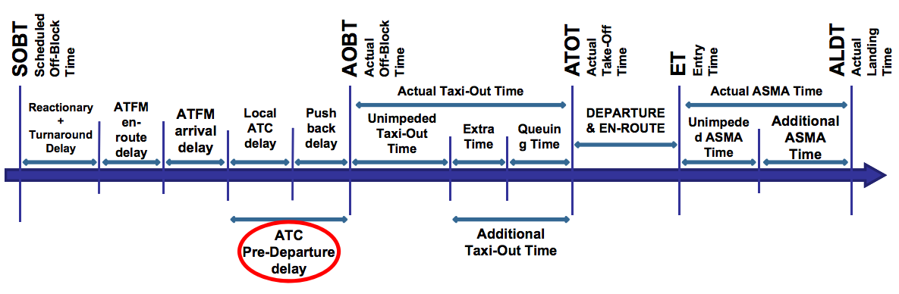

---
params:
  icao: "XXXX"
  iata: "YYY"
  name: "airport name"
  state: "state name"
  tfc: !r mtcars
  thru: !r mtcars
  atfm: !r mtcars
  slot: !r mtcars
  asma: !r mtcars
  txot: !r mtcars
  txit: !r mtcars
  pddly: !r mtcars
  turn: !r mtcars
  punc: !r mtcars
title: "`r params$icao`"
author: "AIU Home"
output: 
  flexdashboard::flex_dashboard:
    orientation: rows # columns
    logo: "euctrl-logo-noname_48x48.png"
    #vertical_layout: scroll # fill # forces filled page (not good for multiple charts)
---

<script>
$('.navbar-logo').wrap('<a href="http://www.eurocontrol.int">');
$('.navbar-author').wrap('<a href="http://ansperformance.eu">');
</script>

<style>
.navbar-author {
  color: white;
}
</style>

```{r setup, include=FALSE}
library(flexdashboard)
library(ggplot2)
library(dplyr)
library(tidyr)
library(plotly)
library(magick)
```
```{r plotly-utility}
tick_yr <- list(dtick = 1
    ,ticktext = list("Jan", "Feb", "Mar", "Apr", "May", "Jun", "Jul", "Aug", "Sep", "Oct", "Nov", "Dec")
    ,tickvals = list(1, 2, 3, 4, 5, 6, 7, 8, 9, 10, 11, 12)
    ,tickmode = "array"
    ,range = c(0.5,12.5))
tick_yr_no_title <- list(
   title = ""
  ,dtick = 1
  ,ticktext = list("Jan", "Feb", "Mar", "Apr", "May", "Jun", "Jul", "Aug", "Sep", "Oct", "Nov", "Dec")
  ,tickvals = list(1, 2, 3, 4, 5, 6, 7, 8, 9, 10, 11, 12)
  ,tickmode = "array"
  ,range = c(1,12))
```

<!-- div style="position:absolute;top:0px;right:0px;" -->
<!-- img src="ECTRL-logo.svg"/ -->
<!-- img src="logo-test-apple.png"/ -->
<!-- /div -->

# Overview {data-icon="fa-home"}

## Column ----------------------------------------------------------

### Aerodrome Layout

```{r}
filename <- paste("data-ad-charts/", params$icao, ".png", sep="") 
ad_chart <- magick::image_read(filename)
if(params$icao %in% c("EHAM", "LEMD", "LSZH")){
  angle <- 300
  ad_chart <- ad_chart %>% magick::image_rotate(angle)
}
ad_chart %>% image_trim()
```

### General

Airport: `r params$name`    
ICAO/IATA Code: `r params$icao`/`r params$iata`    
State: `r params$state`    
Annual traffic:  NEED DATA 4 last full year
Active runways: NEED DATA 4 active runway

</br>
The information on this dashboard is provided for information purposes.
For more details refer to the pointers in the **About** section.

## Column ----------------------------------------------------------

### Summary

```{r front-page-table}
source("./R/prepare_frontpage_DT.R")

out <- prepare_front_page_DT(params$icao, params$tfc, params$asma, params$txot, params$atfm)

out %>% 
  datatable(
      options = list(
        dom             = "t"        # show only table
        ,pageLength     = nrow(out)  # number of rows shown
        ,columnDefs     = list(list(className = 'dt-center'
                                    , targets = "_all" ))  # or targets = 0:4
          # widget callback for sparkline
          ,fnDrawCallback = htmlwidgets::JS('function(){
                                  HTMLWidgets.staticRender();  }' )
          ) #end options
      ,escape = FALSE      # set escape to FALSE for htmlwidget/sparkline
      ,colnames   = c("Indicator","Reporting Month", "% Change <br>Previous Month"
                      ,"12-month Trend")
      ) %>% 
  spk_add_deps() %>%       # add sparkline dependencies
  formatPercentage(
    3, 2    # format 3rd column as % and 2 digits
    )
```

### Powered By

```{r, out.width="40%", fig.pos="float"}

```


# Traffic

## Row ----------------------------------------------------------

### Annual Traffic

```{r}
# annual bar chart
mvts_pa <- params$tfc %>% select(YEAR, FLT_TOT_1 ) %>%
  group_by(YEAR) %>%
  summarise(FLT_TOT = sum(FLT_TOT_1, na.rm = TRUE)) %>% ungroup()

# annotation - ytd
mvts_thisyear = params$tfc %>% filter(YEAR == max(YEAR))
mvts_jan = mvts_thisyear %>% filter(MONTH_NUM == "01") %>% 
  summarise(FLT_TOT = sum(FLT_TOT_1, na.rm = TRUE))
max_mth  <- max(mvts_thisyear$MONTH_NUM)
mvts_last<- mvts_thisyear %>% filter(MONTH_NUM == max_mth) %>%
  summarise(FLT_TOT = sum(FLT_TOT_1, na.rm = TRUE))
mvts_ytd <- (mvts_last - mvts_jan) / mvts_jan

msg     <- paste0("<b>YTD: ", round(mvts_ytd, 2),"% </b>")
msg_y   <- mvts_pa %>% 
  filter(YEAR == as.integer(max(YEAR)) - 1) %>% 
  mutate(FLT_TOT = 0.7 * FLT_TOT) %>% pull(FLT_TOT)
key_msg <- list(x = unique(mvts_thisyear$YEAR), y = msg_y
                ,text = msg
                ,size = 14
                ,showarrow = FALSE)

# experiment with other font
# deactivated 
# font <- list(family = "Courier New, monospace", size = 18, color = "#7f7f7f")
xax <- list(title="")
# yax <- list(title="Number of flights", titlefont = font)
yax <- list(title="Number of flights")

mvts_pa %>%
  plot_ly(x = ~YEAR, y = ~FLT_TOT) %>%
  add_trace(type = "bar", name = "Traffic"
            ,hoverinfo = "text"
            ,hovertemplate = paste(
               "Year: %{x}"
              ,"<br>Flights: %{y}" 
            )) %>% 
  layout(xaxis = xax, yaxis = yax
         ,annotations = key_msg
    )                    #layout(autosize = F, width = 300, height = 300)
```

### Annual Variation of Daily Movements 
<!-- add this behind header to size box {data-width=300} -->

```{r}
tmp <- params$tfc %>%
  select(YEAR, DATE = FLT_DATE, FLT_DEP_1, FLT_ARR_1) %>%
  pivot_longer(cols = starts_with("FLT_"), names_to = "PHASE", values_to = "MVTS") %>%
  separate(PHASE, into = c(NA, "PHASE", NA), sep = "_")

xax <- list(title = "")
yax <- list(title = "Movements per day")

pbox_group <- tmp %>%
  plot_ly(x = ~YEAR, y = ~MVTS, color = ~PHASE, type = "box") %>%
  layout(boxmode = "group", xaxis=xax, yaxis=yax) %>%
  config(displayModeBar = FALSE)
pbox_group
```

## Row -----------------------------------------------------------

### Monthly Traffic

```{r}
# monthly trend
mvts_pm <- params$tfc %>% select(YEAR, MONTH_NUM, FLT_TOT_1) %>%
  group_by(YEAR, MONTH_NUM) %>%
  summarise(FLT_TOT = sum(FLT_TOT_1, na.rm = TRUE)) %>% ungroup()

# annotation - highlight highest monthly traffic in the last years
mvts_pm_max <- mvts_pm %>% filter(FLT_TOT == max(FLT_TOT))

msg         <- paste0( "<b>Busiest month <br>(last 5 years): <br>"
                      ,mvts_pm_max$MONTH_NUM, "-", mvts_pm_max$YEAR
                      ,"<br>", mvts_pm_max$FLT_TOT, "</b>")

# replaced with add_annotations - c.f. below
#key_msg     <- list( text = msg
#                    , x   = mvts_pm_max$MONTH_NUM
#                    , y   = mvts_pm_max$FLT_TOT 
#                    , showarrow = TRUE)

# plot
xax <- tick_yr_no_title
yax <- list(title="Number of flights", rangemode = "tozero")

mvts_pm %>%
  plot_ly(x = ~MONTH_NUM, y = ~FLT_TOT, group = ~YEAR, color = ~YEAR) %>%
  add_trace( type = 'scatter', mode = 'markers+lines') %>%
  add_annotations( text = msg
                  , x = mvts_pm_max$MONTH_NUM
                  , y = mvts_pm_max$FLT_TOT
                  , showarrow = TRUE, ax = 50, ay = 100) %>%
  layout( xaxis = xax, yaxis=yax
        # ,annotations = key_msg
           )  %>%       #layout(autosize = F, width = 300, height = 300)
  config(displayModeBar = FALSE)
```

### Hourly Throughput

```{r}
thru <- params$thru %>% 
  select(APT_ICAO, YEAR, MONTH, TIME, SRC_PHASE, N_BIN_AVG) %>%
  filter(YEAR == max(YEAR)) %>% filter(MONTH == max(MONTH))

thru_tot <- thru %>% 
  group_by(APT_ICAO, YEAR, MONTH, TIME) %>% 
  summarise(N_BIN_AVG = sum(N_BIN_AVG, na.rm = TRUE)) %>%
  ungroup() %>%
  mutate(SRC_PHASE = "TOT")

thru <- thru %>% bind_rows(thru_tot) %>% arrange(TIME) %>%
  mutate(TIME = strtrim(TIME, 5))
#  mutate(TIME = lubridate::hm(TIME))
# TIME seems to be turned to string!!!!, i.e. time formatting does not work!!!

#xax = list(title= "", type = 'time', tickformat = "%H%M") # 
xax = list(title="", type = "category" ,range = c(-2,72)) #
yax = list(title= 'Average throughput [flights/hour]')

mth <- unique(thru$MONTH)
msg = paste0("<b>Average 15-min rolling hour <br>throughput-weekdays Month ", mth,"</b>")

thru %>% 
  plot_ly(x = ~TIME, y = ~N_BIN_AVG, color = ~SRC_PHASE) %>%
  group_by(SRC_PHASE) %>%
  add_lines(type = 'scatter') %>%    
  add_annotations(text = msg
                 , x = "12:00:00"
                 , y = 0.1 * max(thru$N_BIN_AVG) 
                 , showarrow = FALSE, ax = 0, ay = 0  # no arrow, no offset
                 , align = "center"
                 ) %>%
  layout( xaxis = xax, yaxis=yax
         ,hovermode = "x unified") %>%
  config(displayModeBar = FALSE)
```


# ATFM

## Row -----------------------------------------------------------

### Annual Arrival ATFM Delay

```{r atfm_pa}
atfm_pa <- params$atfm %>% 
  select(YEAR, FLT_ARR_1, DLY_APT_ARR_1, AD_DISRUPTION, AD_CAPACITY, AD_WEATHER
         , AD_DISRUPTION_ATC, AD_CAPACITY_ATC, AD_STAFFING_ATC, AD_EVENTS
         ) %>%
  group_by(YEAR) %>%
  summarise( FLT_ARR_TOT     = sum(FLT_ARR_1,     na.rm = TRUE)
            ,DLY_APT_ARR_TOT = sum(DLY_APT_ARR_1, na.rm = TRUE)
            ,AD_DISRUPTION   = sum(AD_DISRUPTION, na.rm = TRUE)
            ,AD_CAPACITY     = sum(AD_CAPACITY,   na.rm = TRUE)
            ,AD_WEATHER      = sum(AD_WEATHER,    na.rm = TRUE)
            ,AD_DISRUPTION_ATC=sum(AD_DISRUPTION_ATC, na.rm = TRUE)
            ,AD_CAPACITY_ATC = sum(AD_CAPACITY_ATC, na.rm = TRUE)
            ,AD_STAFFING_ATC = sum(AD_STAFFING_ATC, na.rm = TRUE)
            ,AD_EVENTS       = sum(AD_EVENTS,     na.rm = TRUE)
            ) %>% ungroup() %>% 
  tidyr::pivot_longer(cols = starts_with("AD_"), names_to = "REG_REASON", values_to = "DLY") %>%
  mutate(AVG_ARR_ATFM_DLY = DLY_APT_ARR_TOT / FLT_ARR_TOT
         ,AVG_ARR_ATFM_REG= DLY / FLT_ARR_TOT)

atfm_pa %>% 
  plot_ly(x = ~YEAR, y = ~AVG_ARR_ATFM_REG, color = ~REG_REASON, type = "bar") %>%
  layout(barmode = "stack"
         , xaxis = list(title = "")
         , yaxis = list(title="Average arrival ATFM delay [min/arr]")) %>% 
config(displayModeBar = FALSE)
```

### Monthly Arrival ATFM Delay

```{r}
# monthly trend
atfm_pm <- params$atfm %>% 
  #filter(YEAR == max(YEAR)) %>%
  select(YEAR, MONTH_NUM, FLT_ARR_1, DLY_APT_ARR_1, AD_DISRUPTION, AD_CAPACITY, AD_WEATHER
         , AD_DISRUPTION_ATC, AD_CAPACITY_ATC, AD_STAFFING_ATC, AD_EVENTS
         ) %>%
  group_by(YEAR, MONTH_NUM) %>%
  summarise( FLT_ARR_TOT     = sum(FLT_ARR_1,     na.rm = TRUE)
            ,DLY_APT_ARR_TOT = sum(DLY_APT_ARR_1, na.rm = TRUE)
            ,AD_DISRUPTION   = sum(AD_DISRUPTION, na.rm = TRUE)
            ,AD_CAPACITY     = sum(AD_CAPACITY,   na.rm = TRUE)
            ,AD_WEATHER      = sum(AD_WEATHER,    na.rm = TRUE)
            ,AD_DISRUPTION_ATC=sum(AD_DISRUPTION_ATC, na.rm = TRUE)
            ,AD_CAPACITY_ATC = sum(AD_CAPACITY_ATC, na.rm = TRUE)
            ,AD_STAFFING_ATC = sum(AD_STAFFING_ATC, na.rm = TRUE)
            ,AD_EVENTS       = sum(AD_EVENTS,     na.rm = TRUE)
            ) %>% ungroup() %>% 
  tidyr::pivot_longer(cols = starts_with("AD_"), names_to = "REG_REASON", values_to = "DLY") %>%
  mutate(AVG_ARR_ATFM_DLY = DLY_APT_ARR_TOT / FLT_ARR_TOT
         ,AVG_ARR_ATFM_REG= DLY / FLT_ARR_TOT)


#############
filter_years <- atfm_pm %>% pull(YEAR) %>% unique()
button_list  <- lapply(1:length(filter_years), function(x){
  list(method = "restyle",
       args = list("transforms[0].value", filter_years[x]),
       label = filter_years[x])
})


button_type_list <-  list(
  type = 'dropdown',
 # type = 'buttons',
  bgcolor = '#c3c1e8',
 active = length(filter_years)-1,
 direction = 'right'
 , xref = "paper", x = 0.3, xanchor = 'left'
 , yref = "paper", y = 1.2, yanchor = "bottom",
#  pad = list('r'= 0, 't'= 10, 'b' = 10),   # adding xref, yref & without padding buttons stay fixed
  buttons = button_list
)
##########################
 
atfm_pm %>%
  plot_ly(x = ~MONTH_NUM, y = ~AVG_ARR_ATFM_REG
          #https://github.com/ropensci/plotly/issues/1502
        # define mapping variable for transform filter, i.e. cannot link directly to ~YEAR!!!
        , customdata=~YEAR
          , color = ~REG_REASON
          , type = "bar"
          , transforms = list(
              list(
                type = 'filter',
                target = "customdata",
                operation = '=',
                value = "2020"
                  )
              ) # end transforms list
        ) %>%
  layout( barmode = "stack"
         ,xaxis = tick_yr_no_title
         ,yaxis=list(title="Average arrival ATFM delay [min/arr]")
         ,showlegend = FALSE
         ,updatemenus = list( button_type_list )
         ) %>% 
config(displayModeBar = FALSE)
```

## Row --------------------------------------------------------------------

### Daily Arrival ATFM Delay

```{r}
tmp <- params$atfm %>% group_by(FLT_DATE) %>%
  summarise( ARRS         = sum(FLT_ARR_1, na.rm = TRUE)
            ,TOT_ARR_ATFM = sum(DLY_APT_ARR_1, na.rm = TRUE)
            ,DLYD_ARRS    = sum(FLT_ARR_1_DLY, na.rm = TRUE)
            ,DLYS_ARRS_15 = sum(FLT_ARR_1_DLY_15, na.rm = TRUE)
            )

worst_day_last_year <- tmp %>%
  top_n(365, FLT_DATE) %>%
  filter(TOT_ARR_ATFM == max(TOT_ARR_ATFM, na.rm = TRUE))
worst_day_date <- worst_day_last_year$FLT_DATE
worst_day_dly  <- worst_day_last_year$TOT_ARR_ATFM
worst_day_avgATFMdly <- worst_day_last_year$TOT_ARR_ATFM / worst_day_last_year$ARRS

key_msg <- paste0( "<b>Worst day in last 12 months: ", worst_day_date
                  ,"<br>with total Arrival ATFM Delay: ", worst_day_dly
                  ,"<br>(avg. Arrival ATFM Delay: ", worst_day_avgATFMdly, "</b>")

p <- tmp %>%
  plot_ly(x = ~FLT_DATE, y = ~TOT_ARR_ATFM
          , type = 'scatter', mode = 'lines'
          , line = list(shape = "hvh", width = 1)
          ) %>%
  add_annotations(text = key_msg
                  , x = worst_day_date, y = worst_day_dly
                  , showarrow = TRUE, ax = -50, ay = -50
                  , align = "right"
                  ) %>%
  layout(#title = "Daily Total Arrival ATFM Delay"
         #, margin = list(t = 75)  # increase margin to deconflict titel and buttons
         #, 
         xaxis = list(title = ""
         , rangeselector = list(
        buttons = list(
          list(
            count = 3,
            label = "3 mo",
            step = "month",
            stepmode = "backward"),
          list(
            count = 6,
            label = "6 mo",
            step = "month",
            stepmode = "backward"),
          list(
            count = 1,
            label = "1 yr",
            step = "year",
            stepmode = "backward"),
          list(
            count = 1,
            label = "YTD",
            step = "year",
            stepmode = "todate"),
          list(step = "all"))),

      rangeslider = list(type = "date")
                        )
         , yaxis = list(title = "Arrival ATFM Delay [min]")
         ) %>% 
  
  config(displayModeBar = F)   # deactivate complete ModeBar
p
```


### Share

```{r atfm-ytd}
atfm_pm %>% group_by(REG_REASON) %>%
  summarise( FLT_ARR_TOT = sum(FLT_ARR_TOT, na.rm = TRUE)
            ,DLY =         sum(DLY, na.rm = TRUE)) %>%
  ungroup() %>%
  mutate(DLY_TOT    = sum(DLY, na.rm = TRUE)
         ,DLY_SHARE = DLY / DLY_TOT ) %>%
  
  plot_ly(labels = ~REG_REASON, values = ~DLY_SHARE) %>%
    add_pie(hole = 0.4) 
# default legend on right-hand side = no specs
#%>% layout(legend = list(orientation = 'h', x = 0, y =-0.1))
```

# ASMA

## Row ------------------------------------------------------------------

### Annual ASMA

```{r ASMA-annual}
# annual bar chart
asma_pa <- params$asma %>% select(YEAR, TIME_ASMA_ADD_2, TIME_ASMA_UNIMP_2, FLT_ASMA_UNIMP_2 ) %>%
  group_by(YEAR) %>%
  summarise( TOT_ADD_ASMA_TIME = sum(TIME_ASMA_ADD_2,   na.rm = TRUE)
            ,TOT_UNIMP_TIME    = sum(TIME_ASMA_UNIMP_2, na.rm = TRUE)
            ,TOT_FLT           = sum(FLT_ASMA_UNIMP_2,  na.rm = TRUE)
  ) %>% ungroup %>%
  mutate( AVG_UNIMP_TIME        = TOT_UNIMP_TIME    / TOT_FLT
         ,AVG_ADD_ASMA_TIME     = TOT_ADD_ASMA_TIME / TOT_FLT) 

asma_pa %>%
  plot_ly(x=~YEAR, y=~AVG_ADD_ASMA_TIME
          , type = "bar"
          , showlegend = FALSE
          , name = "average add. ASMA"
          ) %>%
  #add_bars(x=~YEAR, y=~AVG_ADD_ASMA_TIME, type = "bar")%>%
  layout(barmode = "stack"
         ,xaxis = list(title = "", type = "category")
         ,yaxis = list(title = "Average Additional ASMA Time [min/arr]")
         ) 

#%>%
#  add_annotations(
#    text = "example text in graphic annual variation"
#    ,xref = "paper",yref = "paper"
#    ,x = 0.1, y = 1.05
#    ,xanchor = "middle",yanchor = "top", showarrow = FALSE
#    ,font = list(size = 15))
#asma_pm <- asma %>% 
#  mutate(YEAR_MONTH = sprintf("%d-%02d", YEAR, MONTH_NUM))
```

### Monthly ASMA

```{r ASMA-monthly}
asma_pm <- params$asma %>%
  select(YEAR, MONTH_NUM, TIME_ASMA_ADD_2, TIME_ASMA_UNIMP_2, FLT_ASMA_UNIMP_2 ) %>%
  group_by(YEAR, MONTH_NUM) %>%
  summarise( TOT_ADD_ASMA_TIME = sum(TIME_ASMA_ADD_2,   na.rm = TRUE)
            ,TOT_UNIMP_TIME    = sum(TIME_ASMA_UNIMP_2, na.rm = TRUE)
            ,TOT_FLT           = sum(FLT_ASMA_UNIMP_2,  na.rm = TRUE)
  ) %>% ungroup %>%
  mutate( AVG_ADD_ASMA_TIME     = TOT_ADD_ASMA_TIME / TOT_FLT
         ,AVG_UNIMP_TIME        = TOT_UNIMP_TIME    / TOT_FLT) 

#############
filter_years <- asma_pm %>% pull(YEAR) %>% unique()
button_list  <- lapply(1:length(filter_years), function(x){
  list(method = "restyle",
       args = list("transforms[0].value", filter_years[x]),
       label = filter_years[x])
})

button_type_list <-  list(
 # type = 'dropdown',
  type = 'buttons',
  bgcolor = '#c3c1e8',
 active = length(filter_years)-1,
 direction = 'right'
 , xref = "paper", x = 0.3, xanchor = 'left'
 , yref = "paper", y = 1.2, yanchor = "bottom",
#  pad = list('r'= 0, 't'= 10, 'b' = 10),   # without padding buttons stay fixed
  buttons = button_list
)
##########################
 
asma_pm %>%
  plot_ly(x = ~MONTH_NUM, y = ~AVG_ADD_ASMA_TIME 
          #https://github.com/ropensci/plotly/issues/1502
        # define mapping variable for transform filter, i.e. cannot link directly to ~YEAR!!!
        , customdata=~YEAR
         # , color = ~REG_REASON
          , type = "bar"
          , transforms = list(
              list(
                type = 'filter',
                target = "customdata",
                operation = '=',
                value = "2020"
                  )
              ) # end transforms list
        ) %>%
  layout( barmode = "stack"
         ,xaxis = tick_yr_no_title
         ,yaxis=list(title="Average ASMA Time [min/arr]")
         ,showlegend = FALSE
         ,updatemenus = list( button_type_list )
         ) %>% 
config(displayModeBar = FALSE)
```

## Row --------------------------------------------------------------

### Monthly ASMA Trend (current Year)


```{r asma-trend}
tmp <- params$asma %>% 
  mutate( DATE_YM = paste0(YEAR,"-",MONTH_NUM)
         ,DATE_YM = lubridate::parse_date_time(DATE_YM, "ym")  # coerce date
         ,AVG_ADD_ASMA = TIME_ASMA_ADD_2 / FLT_ASMA_UNIMP_2
         )

p <- tmp %>%
  plot_ly(x = ~DATE_YM, y = ~AVG_ADD_ASMA
          , type = 'scatter', mode = 'lines'
          , line = list(shape = "hvh", width = 1)
          ) %>%
  layout(#title = "Monthly Average Additional ASMA Time"
         #, margin = list(t = 75)  # increase margin to deconflict titel and buttons
         #, 
         xaxis = list(title = ""
         , rangeselector = list(
        buttons = list(
          list(
            count = 3,
            label = "3 mo",
            step = "month",
            stepmode = "backward"),
          list(
            count = 6,
            label = "6 mo",
            step = "month",
            stepmode = "backward"),
          list(
            count = 1,
            label = "1 yr",
            step = "year",
            stepmode = "backward"),
          list(
            count = 1,
            label = "YTD",
            step = "year",
            stepmode = "todate"),
          list(step = "all"))),

      rangeslider = list(type = "date")
                        )
         , yaxis = list(title = "Additional ASMA time [min/arr]")
         ) %>% 
  
  config(displayModeBar = F)   # deactivate complete ModeBar
p
```

### ASMA variation per year and number of arrivals

```{r}
# monthly trend for current year
asma_pm <- params$asma %>%
  select(YEAR, MONTH_NUM, TIME_ASMA_ADD_2, TIME_ASMA_UNIMP_2, FLT_ASMA_UNIMP_2 ) %>%
  group_by(YEAR, MONTH_NUM) %>%
  summarise( TOT_ADD_ASMA_TIME = sum(TIME_ASMA_ADD_2,   na.rm = TRUE)
            ,TOT_UNIMP_TIME    = sum(TIME_ASMA_UNIMP_2, na.rm = TRUE)
            ,TOT_FLT           = sum(FLT_ASMA_UNIMP_2,  na.rm = TRUE)
  ) %>% ungroup %>%
  mutate( AVG_ADD_ASMA_TIME     = TOT_ADD_ASMA_TIME / TOT_FLT
         ,AVG_UNIMP_TIME        = TOT_UNIMP_TIME    / TOT_FLT) 

asma_pm_sc <- asma_pm %>% select(YEAR, MONTH_NUM, AVG_ADD_ASMA_TIME) %>%
  filter(YEAR >= 2016) %>% mutate(YEAR = as.integer(YEAR))
mvts_pm_sc <- mvts_pm %>% select(YEAR, MONTH_NUM, FLT_TOT) %>% 
  mutate(MONTH_NUM = as.integer(MONTH_NUM), YEAR = as.integer(YEAR)) %>%
  filter(YEAR >= 2016)

scatter_df <- left_join(mvts_pm_sc, asma_pm_sc, by=c("YEAR","MONTH_NUM")) %>%
  mutate(YM = paste0(YEAR,"-", MONTH_NUM))

xax <- list(title = "Number of flights")
yax <- list(title = "Average additional ASMA time")

scatter_df %>%
  plot_ly(x = ~FLT_TOT, y=~AVG_ADD_ASMA_TIME, name=~YEAR, size=3, mode = 'markers') %>%
  layout(xaxis = xax, yaxis = yax)
```

  
# Taxi-Times

## Row -----------------------------------------------------------------------

### Avergage Taxi-Out Time

```{r}
# annual bar chart
txot_pa <- params$txot %>% select(YEAR, TIME_TXO_ADD_2, TIME_TXO_UNIMP_2, FLT_TXO_UNIMP_2 ) %>%
  group_by(YEAR) %>%
  summarise( TOT_ADD_TXO_TIME  = sum(TIME_TXO_ADD_2,   na.rm = TRUE)
            ,TOT_UNIMP_TIME    = sum(TIME_TXO_UNIMP_2, na.rm = TRUE)
            ,TOT_FLT           = sum(FLT_TXO_UNIMP_2,  na.rm = TRUE)
  ) %>% ungroup %>%
  mutate( AVG_ADD_TXO_TIME     = TOT_ADD_TXO_TIME / TOT_FLT
         ,AVG_UNIMP_TIME       = TOT_UNIMP_TIME   / TOT_FLT)

txot_pa <- txot_pa %>% 
  tidyr::pivot_longer(cols = c("AVG_ADD_TXO_TIME","AVG_UNIMP_TIME")
                      ,names_to = "TYPE", values_to = "TIME" ) %>%
  mutate(COL_LBL = if_else(TYPE == "AVG_ADD_TXO_TIME"
                           , "avg. additional time", "avg. refernce time"))

g1 <- txot_pa %>%
  plotly::plot_ly(x=~YEAR, y=~TIME
          , type = "bar"
          , showlegend = TRUE
          , color=~COL_LBL
          ) %>%
  plotly::add_annotations(
    text = "annual variation"
    ,xref = "paper",yref = "paper"
    ,x = 0.1, y = 1.05
    ,xanchor = "middle",yanchor = "top", showarrow = FALSE
    ,font = list(size = 15)) %>%
  layout(barmode = "stack"
         , xaxis = list(title="")
         , yaxis = list(title="average taxi-out time [min/dep]"))

g1
```

### Monthly Average Additional Taxi-Out Time

```{r monthly-txot}
# monthly trend
txot_pm <- params$txot %>%
  select(YEAR, MONTH_NUM, TIME_TXO_ADD_2, TIME_TXO_UNIMP_2, FLT_TXO_UNIMP_2 ) %>%
  group_by(YEAR, MONTH_NUM) %>%
  summarise( TOT_ADD_TXO_TIME  = sum(TIME_TXO_ADD_2,   na.rm = TRUE)
            ,TOT_UNIMP_TIME    = sum(TIME_TXO_UNIMP_2, na.rm = TRUE)
            ,TOT_FLT           = sum(FLT_TXO_UNIMP_2,  na.rm = TRUE)
            ,TOT_TOT           = TOT_ADD_TXO_TIME + TOT_UNIMP_TIME
  ) %>% ungroup %>%
  mutate( AVG_ADD_TXO_TIME     = TOT_ADD_TXO_TIME / TOT_FLT
         ,AVG_UNIMP_TIME       = TOT_UNIMP_TIME   / TOT_FLT
         )


g2 <-  plot_ly() %>%
  add_trace(data = txot_pm %>% filter(YEAR == max(YEAR))   # current year
            , x=~MONTH_NUM, y=~AVG_ADD_TXO_TIME
            , color=~as.factor(YEAR),line = list(width = 3)
            , type="scatter", mode="lines") %>%
  add_trace(data = txot_pm %>% filter(YEAR != max(YEAR))
            , x=~MONTH_NUM, y=~AVG_ADD_TXO_TIME
            , color=~as.factor(YEAR),line = list(width = 1)
            , type="scatter", mode="lines") %>%
  layout( xaxis = tick_yr_no_title
         ,yaxis = list(title = "Avg. additional taxi-out time [min/dep]")
         ) 

g2
```

<!-- 
### next next stuff

Looks like something for the header
%>% 
  add_annotations(
    text = "monthly variation per year"
    ,xref = "paper",yref = "paper"
    ,x = 0.5, y = 1.05
    ,xanchor = "middle",yanchor = "top", showarrow = FALSE
    ,font = list(size = 15))


  
## Row --------------------------------------------------------------------

### what goes here?

THink about adding something here.
E.g. most frequently used stands, txot by (most frequent) airspace users

# Taxi-In

---------------------------------    -->

## Row -------------------------------------------------------------------

### Avergage Taxi-In Time

```{r txit}
# annual bar chart
txit_pa <- params$txit %>%
  group_by(YEAR) %>% 
  summarise( TOT_A_TXIT   = sum(TOT_A_TXIT)
            ,TOT_REF      = sum(TOT_REF)
            ,TOT_ADD_TXIT = sum(TOT_ADD_TXIT)
            ,TOT_N        = sum(N_SMPL)) %>% 
  ungroup() %>% 
  mutate( AVG_A_TXIT   = TOT_A_TXIT   / TOT_N
         ,AVG_REF      = TOT_REF      / TOT_N
         ,AVG_ADD_TXIT = TOT_ADD_TXIT / TOT_N)

txit_pa <- txit_pa %>%
  tidyr::pivot_longer( cols = c("AVG_ADD_TXIT","AVG_REF")
                      ,names_to = "TYPE", values_to = "TIME" ) %>%
  mutate(COL_LBL = if_else(TYPE == "AVG_ADD_TXIT"
                           , "avg. additional time", "avg. reference time"))

g1 <- txit_pa %>%
  plotly::plot_ly(x=~YEAR, y=~TIME
          , type = "bar"
          , showlegend = TRUE
          , color=~COL_LBL
          ) %>%
  plotly::add_annotations(
    text = "annual variation"
    ,xref = "paper",yref = "paper"
    ,x = 0.1, y = 1.05
    ,xanchor = "middle",yanchor = "top", showarrow = FALSE
    ,font = list(size = 15)) %>%
  layout(barmode = "stack"
         , xaxis = list(title="")
         , yaxis = list(title="average taxi-in time [min/arr]"))

g1
```

### Monthly Trend

```{r monthly-txit}
# monthly trend
txit_pm <- params$txit %>%
  rename(MONTH_NUM = MONTH) %>%
  select(YEAR, MONTH_NUM, TOT_A_TXIT, TOT_REF, TOT_ADD_TXIT, N_SMPL) %>%
  group_by(YEAR, MONTH_NUM) %>% 
  summarise( TOT_A_TXIT   = sum(TOT_A_TXIT)
            ,TOT_REF      = sum(TOT_REF)
            ,TOT_ADD_TXIT = sum(TOT_ADD_TXIT)
            ,TOT_N        = sum(N_SMPL)) %>% 
  ungroup() %>% 
  mutate( AVG_A_TXIT   = TOT_A_TXIT   / TOT_N
         ,AVG_REF      = TOT_REF      / TOT_N
         ,AVG_ADD_TXIT = TOT_ADD_TXIT / TOT_N)


g2 <-  plot_ly() %>%
  add_trace(data = txit_pm %>% filter(YEAR == max(YEAR))
            , x=~MONTH_NUM, y=~AVG_ADD_TXIT
            , color=~as.factor(YEAR),line = list(width = 3)
            , type="scatter", mode="lines") %>%
  add_trace(data = txit_pm %>% filter(YEAR != max(YEAR))
            , x=~MONTH_NUM, y=~AVG_ADD_TXIT
            , color=~as.factor(YEAR),line = list(width = 1)
            , type="scatter", mode="lines") %>%
  layout( xaxis = tick_yr_no_title
         ,yaxis = list(title="Avg. additional taxi-in time [min/arr]")) 

g2
```


# Pre-Dep \n Delay

## Row -------------------------------------------------------

### Annual Pre-Departure Delay (as reported by airports)

```{r pre-dep-dly-pa}
# annual bar chart
pddly_pa <- params$pddly %>% 
  select(YEAR, TOTAL_DLY_89, TOTAL_DLY_999 , TOTAL_DLY_ZZZ, TOTAL_DLY_OTHER
         , TOTAL_UN_RPTED_DLY, TOTAL_OV_RPTED_DLY) %>%
  group_by(YEAR) %>%
  summarise( TOT_DLY_89        = sum(TOTAL_DLY_89,   na.rm = TRUE)
            ,TOT_DLY_999       = sum(TOTAL_DLY_999,  na.rm = TRUE)
            ,TOT_DLY_ZZZ       = sum(TOTAL_DLY_ZZZ,  na.rm = TRUE)
            ,TOT_DLY_OTHER     = sum(TOTAL_DLY_OTHER,na.rm = TRUE)
            ,TOT_DLY_UNREPORTED= sum(TOTAL_UN_RPTED_DLY, na.rm = TRUE)
            ,TOT_DLY_OVREPORTED= sum(TOTAL_OV_RPTED_DLY, na.rm = TRUE)
  ) %>% ungroup %>%

## grouping for v1 ------------------------------
## discussion Sara & Rainer: do not show overreported
  mutate(
    TOT_DLY_UNID = TOT_DLY_999 + TOT_DLY_ZZZ + TOT_DLY_UNREPORTED 
  ) %>%
  select(YEAR, TOT_DLY_89, TOT_DLY_OTHER, TOT_DLY_UNID)  %>%
  tidyr::pivot_longer(cols = starts_with("TOT_DLY_") , names_to = "DLY_CAT", values_to = "DLY_DUR")

## order DLY_CAT and ensure label naming for legend
pddly_pa$DLY_CAT <- factor(pddly_pa$DLY_CAT
                           ,levels=c("TOT_DLY_UNID", "TOT_DLY_OTHER", "TOT_DLY_89")
                           ,labels=c("unidentified", "other reasons", "ATC pre-departure <br>delay (code 89)"))

g1 <- pddly_pa %>%
  plot_ly(x=~YEAR, y=~DLY_DUR, type="bar", color=~DLY_CAT, legendgroup=~DLY_CAT) %>%
  layout(barmode = "stack"
         ,yaxis = list(title = "Pre-departure delay [min]")
         )

g1
```

### Monthly Pre-departure Delay (as reported by airports)

```{r}
pddly_pm <- params$pddly %>%
  select(YEAR, MONTH_NUM, TOTAL_DLY_89, TOTAL_DLY_999 , TOTAL_DLY_ZZZ, TOTAL_DLY_OTHER
         , TOTAL_UN_RPTED_DLY, TOTAL_OV_RPTED_DLY) %>%
  group_by(YEAR, MONTH_NUM) %>%
  summarise( TOT_DLY_89        = sum(TOTAL_DLY_89,   na.rm = TRUE)
            ,TOT_DLY_999       = sum(TOTAL_DLY_999,  na.rm = TRUE)
            ,TOT_DLY_ZZZ       = sum(TOTAL_DLY_ZZZ,  na.rm = TRUE)
            ,TOT_DLY_OTHER     = sum(TOTAL_DLY_OTHER,na.rm = TRUE)
            ,TOT_DLY_UNREPORTED= sum(TOTAL_UN_RPTED_DLY, na.rm = TRUE)
            ,TOT_DLY_OVREPORTED= sum(TOTAL_OV_RPTED_DLY, na.rm = TRUE)
  ) %>% ungroup %>%
  ## grouping for v1 ------------------------
  mutate(
    TOT_DLY_UNID = TOT_DLY_999 + TOT_DLY_ZZZ + TOT_DLY_OTHER + TOT_DLY_UNREPORTED
  ) %>%
  select(YEAR, MONTH_NUM, TOT_DLY_89, TOT_DLY_OTHER, TOT_DLY_UNID) %>%
  tidyr::pivot_longer(cols = starts_with("TOT_DLY_") , names_to = "DLY_CAT", values_to = "DLY_DUR")

## order DLY_CAT and ensure label naming for legend
pddly_pm$DLY_CAT <- factor(pddly_pm$DLY_CAT
                           ,levels = c("TOT_DLY_UNID", "TOT_DLY_OTHER", "TOT_DLY_89")
                           ,labels = c("unidentified", "other reasons", "ATC pre-departure <br> delay (code 89)"))

button_type_list <-  list(
  buttons = button_list
  ,type = 'dropdown'
 # type = 'buttons',
 , bgcolor = '#c3c1e8'
 , active = length(filter_years)-1
 , direction = 'right'
 # position of button list
 , xref = "paper", x = 0.3, xanchor = 'left'
 , yref = "paper", y = 1.2, yanchor = "bottom"
 
)
##########################
 
pddly_pm %>%
  plot_ly(x = ~MONTH_NUM, y = ~DLY_DUR
          #https://github.com/ropensci/plotly/issues/1502
        # define mapping variable for transform filter, i.e. cannot link directly to ~YEAR!!!
        , customdata=~YEAR
          , color = ~DLY_CAT
          , type = "bar"
          , transforms = list(
              list(
                type = 'filter',
                target = "customdata",
                operation = '=',
                value = "2020"
                  )
              ) # end transforms list
        ) %>%
  layout( barmode = "stack"
         ,xaxis = tick_yr_no_title
         ,yaxis=list(title="Pre-departure delay [min]")
         ,showlegend = TRUE
         ,updatemenus = list( button_type_list )
         ) %>% 
config(displayModeBar = FALSE)
```


## Row -----------------------------------------------------------

### Monthly Pre-Departure Delay Trend

```{r}
tmp <- pddly_pm %>%
  mutate( DATE_YM = paste0(YEAR,"-",MONTH_NUM)
         ,DATE_YM = lubridate::parse_date_time(DATE_YM, "ym")  # coerce date
        # ,AVG_ADD_ASMA = TIME_ASMA_ADD_2 / FLT_ASMA_UNIMP_2
         )
  
  
p <- tmp %>%
  plot_ly() %>%
  add_bars(x = ~DATE_YM, y = ~DLY_DUR
          #, type = 'scatter', mode = 'lines'
          #, line = list(shape = "hvh", width = 1)
          , color = ~DLY_CAT
          ) %>%
  layout(barmode = "stack"
         # xaxis and rangeselector
         ,xaxis = list(title = ""
         , rangeselector = list(
        buttons = list(
          list(
            count = 3,
            label = "3 mo",
            step = "month",
            stepmode = "backward"),
          list(
            count = 6,
            label = "6 mo",
            step = "month",
            stepmode = "backward"),
          list(
            count = 1,
            label = "1 yr",
            step = "year",
            stepmode = "backward"),
          list(
            count = 1,
            label = "YTD",
            step = "year",
            stepmode = "todate"),
          list(step = "all"))),

      rangeslider = list(type = "date")
                        )
         , yaxis = list(title = "Pre-departure delay [min]")
         ) %>% 
  
  config(displayModeBar = F)   # deactivate complete ModeBar
p
```

<!-- DEACTIVATED

### Pre-Departure Delay {data-width=350}

```{r, out.width='200pt'}

```

### Pre-Departure Delay reporting

Airports report pre-departue delay on a flight by flight basis. 
To address incomplete or inconsistent delay codes reported  by airspace user to the airport operator, the airport operator may default to so-called ambiguity-codes.
Ambiguity codes and other codes are summed to **unidentified delay**.

--> 

### Average Pre-Departure Delay

```{r pre-dep-indicator}
predepdly_pm <- params$pddly %>%
  select(YEAR, MONTH_NUM, APT_FLT_DEP
         , TOTAL_DLY_89, TOTAL_DLY_999 , TOTAL_DLY_ZZZ, TOTAL_DLY_OTHER
         , TOTAL_UN_RPTED_DLY, TOTAL_OV_RPTED_DLY) %>%
  group_by(YEAR, MONTH_NUM) %>%
  summarise( TOT_FLT_DEP       = sum(APT_FLT_DEP,    na.rm = TRUE)
            ,TOT_DLY_89        = sum(TOTAL_DLY_89,   na.rm = TRUE)
            ,TOT_DLY_999       = sum(TOTAL_DLY_999,  na.rm = TRUE)
            ,TOT_DLY_ZZZ       = sum(TOTAL_DLY_ZZZ,  na.rm = TRUE)
            ,TOT_DLY_OTHER     = sum(TOTAL_DLY_OTHER,na.rm = TRUE)
            ,TOT_DLY_UNREPORTED= sum(TOTAL_UN_RPTED_DLY, na.rm = TRUE)
            ,TOT_DLY_OVREPORTED= sum(TOTAL_OV_RPTED_DLY, na.rm = TRUE)
  ) %>% ungroup %>%
  ## grouping for v1 ------------------------
  mutate(
     TOT_DLY_UNID  = TOT_DLY_999 + TOT_DLY_ZZZ + TOT_DLY_OTHER + TOT_DLY_UNREPORTED
    ,AVG_PREDEP_DLY= TOT_DLY_89 / TOT_FLT_DEP
  ) %>%
  select(YEAR, MONTH_NUM, AVG_PREDEP_DLY) 

################################################
button_type_list <-  list(
  buttons = button_list
  ,type = 'dropdown'
 # type = 'buttons',
 , bgcolor = '#c3c1e8'
 , active = length(filter_years)-1
 , direction = 'right'
 # position of button list
 , xref = "paper", x = 0.3, xanchor = 'left'
 , yref = "paper", y = 1.2, yanchor = "bottom"
 
)
##########################
 
predepdly_pm %>%
  plot_ly(x = ~MONTH_NUM, y = ~AVG_PREDEP_DLY
          #https://github.com/ropensci/plotly/issues/1502
        # define mapping variable for transform filter, i.e. cannot link directly to ~YEAR!!!
        , customdata=~YEAR
         # , color = ~DLY_CAT
          , type = "bar"
          , transforms = list(
              list(
                type = 'filter',
                target = "customdata",
                operation = '=',
                value = "2020"
                  )
              ) # end transforms list
        ) %>%
  layout( barmode = "stack"
         ,xaxis = tick_yr_no_title
         ,yaxis=list(title="Avg. pre-departure delay [min/dep]")
         ,showlegend = FALSE
         ,updatemenus = list( button_type_list )
         ) %>% 
config(displayModeBar = FALSE)
```

# Turnaround

## Row ----------------------------------------------------------

### Annual Average Turnaround Times

```{r annual_turn_time}
turn_pa <- params$turn %>%  
     select(YEAR, AC_CLASS, AVG_ATTT) %>% 
     filter(AC_CLASS %in% c("H", "MJ", "MT") ) %>%
     group_by(YEAR, AC_CLASS) %>% 
     summarise(AVG_ATTT = mean(AVG_ATTT)) %>%
     ungroup() %>%
     pivot_wider(names_from = "AC_CLASS", values_from = AVG_ATTT)

g1 <- turn_pa %>%
  plot_ly(x = ~YEAR) %>%
  add_bars(y = ~H,  name = "Heavy") %>%
  add_bars(y = ~MJ, name = "Medium Jet") %>%
  add_bars(y = ~MT, name = "Medium Prop") %>%
  layout( xaxis = list(title = "", type = "category")
         ,yaxis = list(title = "average turntime [min]")
         )
g1
```


### Monthly Turnaround Time

```{r monthly_turn_time}
turn_pm <- params$turn %>% 
    select(YEAR, MONTH, AC_CLASS, AVG_ATTT, AVG_STTT) %>% 
    filter(AC_CLASS %in% c("H", "MJ", "MT") ) %>%
    group_by(YEAR, MONTH, AC_CLASS) %>% 
    summarise(AVG_ATTT = mean(AVG_ATTT), AVG_STTT = mean(AVG_STTT)) %>%
    ungroup() 

actual_pm <- turn_pm %>%
  select(YEAR, MONTH, AC_CLASS, AVG_ATTT) %>% 
  pivot_wider(names_from = "AC_CLASS", names_prefix = "ACT_", values_from = AVG_ATTT)

sched_pm <- turn_pm %>%
  select(YEAR, MONTH, AC_CLASS, AVG_STTT) %>% 
  pivot_wider(names_from = "AC_CLASS", names_prefix = "SCH_", values_from = AVG_STTT)


g2 <- actual_pm %>% filter(YEAR == max(YEAR)) %>%
  plot_ly(x = ~MONTH) %>%
  add_lines(y = ~ACT_H,  name = "actual Heavy") %>%
  add_lines(y = ~ACT_MJ, name = "actual Medium Jet") %>%
  add_lines(y = ~ACT_MT, name = "actual Medium Prop") %>%
  layout( xaxis = list(title = "", type = "category")
         ,yaxis = list(title = "average turntime [min]")
         )
g2
```


## Row ---------------------------------------------------------------

### Available Turn-Times

add chart with available turnaround times
c.f. EIDW discussion


# Punctuality

## Row ---------------------------------------------------------------

### Arrival Punctuality

```{r arrpunc}
punc_lvls <- c( "EARLY 30+","EARLY 15-30","EARLY 5-15","EARLY 0-5"
               ,"LATE 0-5","LATE 5-15","LATE 15-30","LATE 30-60","LATE 60+")

punc_pa_arr <- params$punc %>% filter(SRC_PHASE == "ARR") %>% 
  group_by(YEAR, GROUP) %>% 
  summarise(N_GRP_YR = sum(N_GRP)) %>% ungroup()

punc_pa_freq <- left_join(
  punc_pa_arr, count(punc_pa_arr, YEAR, wt = N_GRP_YR, name="TOT_YR"))

g1 <- punc_pa_freq %>% 
  plot_ly( x      =~YEAR, y=~(N_GRP_YR / TOT_YR)
          ,color  =~factor(GROUP, levels=punc_lvls)
          ,colors = "RdYlGn"
          ,showlegend = FALSE
          ,legendgroup = ~factor(GROUP, levels=punc_lvls)) %>% 
  add_bars() %>% 
  layout(barmode="stack")


# <!-- # monthly trend -->
punc_pm_arr <- params$punc %>% filter(SRC_PHASE == "ARR", YEAR == max(YEAR)) %>% 
  group_by(YEAR, MONTH, GROUP) %>% 
  summarise(N_GRP_MN = sum(N_GRP)) %>% ungroup()

punc_pm_m <- punc_pm_arr %>% group_by(YEAR, MONTH) %>%
  summarise(N_MNTH = sum(N_GRP_MN)) %>% ungroup()

punc_pm_freq <- punc_pm_arr %>% 
  left_join(punc_pm_m, by=c("YEAR","MONTH")) %>%
  mutate(FREQ = N_GRP_MN / N_MNTH)

g2 <- punc_pm_freq %>%
  plot_ly(x=~MONTH, y=~FREQ
          ,color  =~factor(GROUP, levels=punc_lvls)
          ,colors = "RdYlGn"
          ,showlegend = TRUE
          ,legendgroup = ~factor(GROUP, levels=punc_lvls)) %>% 
  add_bars() %>% 
  layout(barmode="stack")
  
subplot( g1, g2, nrows=1, shareY = TRUE, margin = 0.03, widths = c(0.35, 0.65)) %>%
  layout( yaxis  = list(title = "")     #, yaxis2 = list(showlegend = FALSE)
         ,xaxis2 = tick_yr
  #       ,legend = list(orientation = 'h', x = 0, y =-0.1)
         ) %>%
  # deactivate modebar
  config(displayModeBar = FALSE)
```

### Departure Punctuality

```{r deppunc}
punc_lvls <- c( "EARLY 30+","EARLY 15-30","EARLY 5-15","EARLY 0-5"
               ,"LATE 0-5","LATE 5-15","LATE 15-30","LATE 30-60","LATE 60+")

punc_pa <- params$punc %>% filter(SRC_PHASE == "DEP") %>% 
  group_by(YEAR, GROUP) %>% 
  summarise(N_GRP_YR = sum(N_GRP)) %>% ungroup()

punc_pa_freq <- left_join(
  punc_pa, count(punc_pa, YEAR, wt = N_GRP_YR, name="TOT_YR"))

g1 <- punc_pa_freq %>% 
  plot_ly( x      =~YEAR, y=~(N_GRP_YR / TOT_YR)
          ,color  =~factor(GROUP, levels=punc_lvls)
          ,colors = "RdYlGn"
          ,showlegend = FALSE
          ,legendgroup = ~factor(GROUP, levels=punc_lvls)) %>% 
  add_bars() %>% 
  layout(barmode="stack")


# <!-- # monthly trend -->
punc_pm <- params$punc %>% filter(SRC_PHASE == "DEP", YEAR == max(YEAR)) %>% 
  group_by(YEAR, MONTH, GROUP) %>% 
  summarise(N_GRP_MN = sum(N_GRP)) %>% ungroup()

punc_pm_m <- punc_pm %>% group_by(YEAR, MONTH) %>%
  summarise(N_MNTH = sum(N_GRP_MN)) %>% ungroup()

punc_pm_freq <- punc_pm %>% 
  left_join(punc_pm_m, by=c("YEAR","MONTH")) %>%
  mutate(FREQ = N_GRP_MN / N_MNTH)

g2 <- punc_pm_freq %>%
  plot_ly(x=~MONTH, y=~FREQ
          ,color  =~factor(GROUP, levels=punc_lvls)
          ,colors = "RdYlGn"
          ,showlegend = TRUE
          ,legendgroup = ~factor(GROUP, levels=punc_lvls)) %>% 
  add_bars() %>% 
  layout(barmode="stack")
  
subplot( g1, g2, nrows=1, shareY = TRUE, margin = 0.03, widths = c(0.35, 0.65)) %>%
  layout( yaxis  = list(title = "")     #, yaxis2 = list(showlegend = FALSE)
         ,xaxis2 = tick_yr
  #       ,legend = list(orientation = 'h', x = 0, y =-0.1)
         ) %>%
  # deactivate modebar
  config(displayModeBar = FALSE)
```

## Row ---------------------------------------------------------------

### Arrival On-Time Performance vs +/-15 or +/-5 min windows

```{r}
otp_vs_wi <- punc_pa_arr %>% 
  mutate(
    OTP = case_when(GROUP %in% c("EALRY 30+","EARLY 15-30","EARLY 5-15","EARLY 0-5"
                                 ,"LATE 0-5","LATE 5-15") ~ "OTP", TRUE ~ "NA")
  ,WI15 = case_when(GROUP %in% c("EARLY 5-15","EARLY 0-5","LATE 0-5","LATE 5-15") ~ "WI15"
                    , TRUE ~ "NA")
  , WI5 = case_when(GROUP %in% c("EARLY 0-5","LATE 0-5") ~ "WI5", TRUE ~ "NA")
  ) %>% 
  group_by(YEAR) %>% 
  summarise(N_YR = sum(N_GRP_YR)
            ,OTP = sum(N_GRP_YR[OTP == "OTP"])
            ,WI15= sum(N_GRP_YR[WI15=="WI15"])
            , WI5= sum(N_GRP_YR[WI5=="WI5"])
            ) %>% 
  mutate(OTP_P = OTP / N_YR, WI15_P = WI15/N_YR, WI5_P = WI5 / N_YR)

otp_vs_wi %>%
  plot_ly(y=~YEAR) %>%
    add_trace(x=~OTP_P, type="bar", name="OTP", orientation = 'h') %>%
    add_trace(x=~WI15_P, type="bar", name="WI15", orientation = 'h') %>%
    add_trace(x=~WI5_P, type="bar", name="WI5", orientation = 'h') %>%
  layout(yaxis=list(title=""), xaxis=list(title="Share of flights [%]")) %>%
  # deactivate modebar
  config(displayModeBar = FALSE)
```

### Departure On-Time Performance vs +/-15 or +/-5 min windows

```{r}
otp_vs_wi <- punc_pa %>% 
  mutate(
    OTP = case_when(GROUP %in% c("EALRY 30+","EARLY 15-30","EARLY 5-15","EARLY 0-5"
                                 ,"LATE 0-5","LATE 5-15") ~ "OTP", TRUE ~ "NA")
  ,WI15 = case_when(GROUP %in% c("EARLY 5-15","EARLY 0-5","LATE 0-5","LATE 5-15") ~ "WI15"
                    , TRUE ~ "NA")
  , WI5 = case_when(GROUP %in% c("EARLY 0-5","LATE 0-5") ~ "WI5", TRUE ~ "NA")
  ) %>% 
  group_by(YEAR) %>% 
  summarise(N_YR = sum(N_GRP_YR)
            ,OTP = sum(N_GRP_YR[OTP == "OTP"])
            ,WI15= sum(N_GRP_YR[WI15=="WI15"])
            , WI5= sum(N_GRP_YR[WI5=="WI5"])
            ) %>% 
  mutate(OTP_P = OTP / N_YR, WI15_P = WI15/N_YR, WI5_P = WI5 / N_YR)

otp_vs_wi %>%
  plot_ly(y=~YEAR) %>%
    add_trace(x=~OTP_P, type="bar", name="OTP", orientation = 'h') %>%
    add_trace(x=~WI15_P, type="bar", name="WI15", orientation = 'h') %>%
    add_trace(x=~WI5_P, type="bar", name="WI5", orientation = 'h') %>%
  layout(yaxis=list(title=""), xaxis=list(title="share of flights [%]")) %>%
  # deactivate modebar
  config(displayModeBar = FALSE)
```


# About

## Row ------------------------------------------------------------------

### Sponsored by {data-height=100}

```{r, out.width="40%", fig.pos="float"}

```

### About this Dashboard

This data is published by the EUROCONTROL Performance Review Unit (PRU) in the interest of the exchange of information. 
It may be copied in whole or in part providing that this copyright notice © and disclaimer are included. 
The information may not be modified without prior written permission from the EUROCONTROL Performance Review Unit.
The information does not necessarily reflect the official views or policy of EUROCONTROL, which makes no warranty, either implied or expressed, for the information contained in this document, including its accuracy, completeness or usefulness.
Every effort has been made to ensure that the information and analysis contained on this website are as accurate and complete as possible. Despite these precautions, should you find any errors or inconsistencies or if you have any questions then please contact us at: Performance Review Unit (PRU-Support@eurocontrol.int).

### About Performance Review Unit

The PRU is responsible for monitoring and reviewing the performance of the Pan-European ANS system across a number of key performance areas.
As part of the EUROCONTROL Agency, the PRU supports the independent Performance Review Commission (PRC) in running the EUROCONTROL Performance Review System and executing the associated PRC work programme with the appropriate level of independence.
The PRU also provides support to the European Commission (EC) on the SES Performance and Charging Schemes.
In performing its tasks, the PRU maintains transparent working arrangements with service providers, airspace user organisations and the industry.
Although the PRU is independent, it is administratively reporting to the Directorate European Civil-Military Aviation (DECMA).
For feedback or questions please contact us at: Performance Review Unit (PRU-Support@eurocontrol.int).

## Row ------------------------------------------------------------------

### Data and Methodolgy

IFR traffic data and ATFM delay related data is extracted from the Network Manager.     
All other airport related data is collected through the Airport Operator Data Flow (APDF).
Under the APDF airports are required to report flight-by-flight data on a monthly basis. The data is reported during the month following the month of operations. 
Thus, typically, APDF data becomes available the 2nd month following the month of operation.

* traffic data comprises all IFR flight plans for the airport
* ATFM delay data captures the arrival ATFM delay triggered by constraints at the airport.
* additional ASMA time measures the difference between an observed travel time elapsing from entering the 40NM radius around the airport to landing. This time is compared against a reference time to the respective entry sector, aircraft type, and landing runway.
* in analogy, additional taxi-times are measured for the taxi-out and taxi-in phase. The observed taxi times are compared with a respective reference time. The refernce time considers the parking position and runway used by the departure/arrival.
* pre-dearture delay provides for the airspace user reported delay reasoning in case of departures blocking off late. Delay codes have to be provided for delays >= 4 minutes. Airports per se do not validate these delay codes, however, effort is underway to ensure appropriateness of the reported delay codes.
* turnaround shows the time elapsing between an aircraft blocking in and blocking off for the next flight.
* punctuality is measured for the arrival and departure phase. The delay is expressed as the difference between the actual and scheduled off-block (i.e. departure) or in-block (i.e. arrival).


